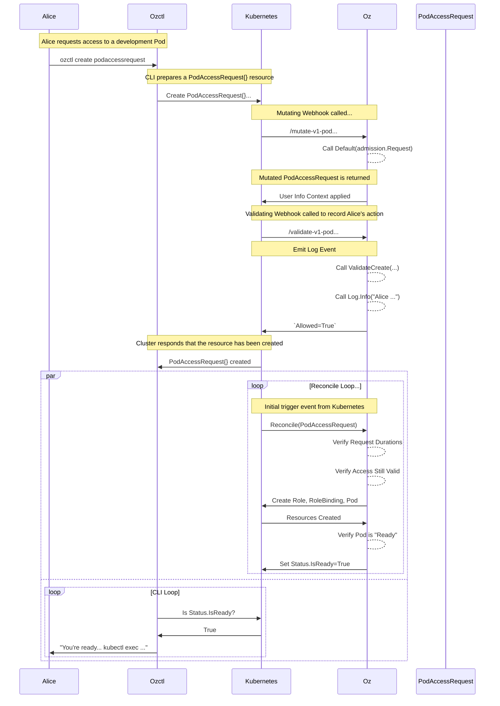

[access_config]: https://github.com/diranged/oz/blob/main/API.md#accessconfig
[exec_access_request]: API.md#execaccessrequest
[exec_access_template]: API.md#execaccesstemplate
[pod_access_request]: API.md#podaccessrequest
[pod_access_template]: API.md#podaccesstemplate
[pts_mutation_config]: API.md#crds.wizardofoz.co/v1alpha1.PodTemplateSpecMutationConfig
[kube_crd]: https://kubernetes.io/docs/concepts/extend-kubernetes/api-extension/custom-resources/
[kube_rbac]: https://kubernetes.io/docs/reference/access-authn-authz/rbac/
[kube_subjects]: https://kubernetes.io/docs/reference/access-authn-authz/rbac/#referring-to-subjects

# Oz RBAC Controller

[](https://github.com/diranged/oz/actions/workflows/main.yaml)
[](https://coveralls.io/github/diranged/oz?branch=main)
[](https://goreportcard.com/report/github.com/diranged/oz)

_The Wizard of Oz_: The "Great and Powerful Oz", or also known as the "man
behind the curtain."

**"Oz RBAC Controller"** is a Kubernetes operator that provides short-term
elevated RBAC privileges to end-users through the native Kubernetes
[RBAC][kube_rbac] system. It aims to be the "man behind the curtain" -
carefully creating `Roles`, `RoleBindings` and `Pods` on-demand that enable
developers to quickly get their jobs done, and administrators to ensure that
the principal of least privilege is honored.

**Oz** primarily works with two resource constructs - **Access Requests** and
**Access Templates**.

**Access Templates** are defined by the cluster operators or application owners
to create a "template" for how a particular type of short-term access can be
granted. For example, the [`ExecAccessTemplate`][exec_access_template] defines
a particular target (`DaemonSet` for example) that a user can request access
to, the [`Groups`][kube_subjects] that are allowed to have that access, and
rules around the maximum duration that the request can remain active.

**Access Requests** are created by end-users when they need access to a
resource. RBAC privileges must be granted to users to even create the resource -
but once that is done, actual access to the final target pod is controlled
natively through the Kubernetes RBAC system, ensuring that we are not
bypassing any standard internal RBAC controls.

An example is the [`ExecAccessRequest`][exec_access_request] resource which
points to a particular [`ExecAccessTemplate`][exec_access_template]. When the
request is created, the **Oz** controller will dynamically create a `Role` and
`RoleBinding` granting access into the desired target pod to the specific
groups defined in the template itself.

## Example Use Cases

### Use Case: Interactive "Shell" access into Production-Like Pod

A developer needs to run a manual command from within a Production environment -
such as a database migration, or investigation into the a code bug that is
occuring, etc. It is not a good practice for that shell command to execute
within a live container that is actively taking traffic.

_Why is this not possible today?_

The Kubernetes RBAC system has several short-comings. Namely that wildcards
(`*`) can not be used in the `resources` key. Aside from that, we consider it a
bad practice for developers to have live access into pods that are serving real
traffic - there is a high risk that mutation to the pod (writing of new files,
changing state, etc) can occur, which leaves your environment "tainted".

_How does Oz solve this?_

*Oz* provides a [`PodAccessTemplate`][pod_access_template] that administrators
or application owners can use to pre-define a type of shell access for
developers. The `PodAccessTemplate` can either refer to an exising
`Deployment`, `DaemonSet` or `StatefulSet` -- or it can contain its own
`PodSpec` entirely on its own for a completely custom environment.

When a [`PodAccessRequest`][pod_access_request] is created, *Oz* will verify
its validity, and then dynamically provision a new `Pod` for that particular
request. Because this new pod does not have any of the original matching
Labels, it will not be in the path of any live traffic. Furthermore, the
`spec.container[0].command` (and other) flags can be overwritten in the
[`PodAccessTemplate`][pod_access_template] to ensure that the application does
not start up at all if desired.

Access to the launched `Pod` will be granted through temporary `Role` and
`RoleBinding` resource.

### Use Case: "Exec" Access into Specific Live Pods

Certain workloads (`DaemonSets` and `StatefulSets` mostly) have different
charactaristics where launching a copy of a Pod may not be enough to provide
operational access to the applications. In some cases you do need to have
native `kubectl exec ...` or `kubectl debug ...` access for specific pods.

_Why is this not possible today with RBAC?_

The Kubernetes [RBAC][kube_rbac] system does not currently allow for wildcards
(`*`) in the `resource` key. This means that cluster operators must provide
`exec` access into either _all_ pods in a Namespace, or _none_ of them.

_How does Oz solve this?_

*Oz* will use an [`ExecAccessTemplate`][exec_access_template] to pre-define
target pods that are allowed to be `kubectl exec`'d into. When an
[`ExecAccessRequest`][exec_access_request] is created and validated, *Oz* will
then provision temporary `Role` and `RoleBindings` that grant the appropriate
[`Groups`][kube_subjects] access to the pod.

## Installation

### Helm-Installation of the Controller

[helm_chart]: https://github.com/diranged/oz-charts/tree/main/charts/oz
[releases]: https://github.com/diranged/oz/releases

The controller can be installed today through a [helm chart][helm_chart]. The
chart is hosted by Github and can be easily installed like this:

```bash
$ helm repo add oz-charts https://diranged.github.io/oz-charts
$ helm repo update
$ helm search repo oz-charts
NAME        	CHART VERSION	APP VERSION	DESCRIPTION
oz-charts/oz	0.0.6        	0.0.0-rc1  	Installation for the Oz RBAC Controller
```

### Installation of the CLI tool

An [`ozctl` CLI tool](./ozctl) is provided primarily for the end users of the
`AccessRequest` objects. This tool simplifies the process of quickly creating
an access request, waiting for it to be processed, and then reporting
instructions on how to make use of the resources.

#### Released Binaries

The `ozctl` binaries are available through the ["releases"][releases] page and
are built for OSX in both Intel and Arm variants.

#### Installation via `go install...`

You can also install the binaries directly with `go install`... this is useful
for pinning to particular SHAs or unreleased commits.

```sh
RELEASE=main
go install github.com/diranged/oz/ozctl@$RELEASE
```

## Setup Examples

### Developer Access into a Temporary (Dedicated) Pod

For all of the use cases where a developer needs access into a "prod" or
"staging"-like environment, we recommend the
[`PodAccessTemplate`][pod_access_template] and its corresponding
[`PodAccessRequest`][pod_access_request]. The motivation behind this model is
that you can provide developers with predefined access into a workspace that
has access to the various resources (databases, code, tools) that are necessary
- but without putting them directly in the path of traffic.

Example use cases:

* Manually executing a schema migration
* Debugging a piece of code against production data
* Running a [Django Shell](https://realpython.com/lessons/django-shell/) command

#### [`PodAccessTemplate`][pod_access_template]

[pts]: https://kubernetes.io/docs/reference/generated/kubernetes-api/v1.20/#podtemplatespec-v1-core
[dep]: https://kubernetes.io/docs/reference/generated/kubernetes-api/v1.20/#deploymentspec-v1-apps

A simple [`PodAccessTemplate`][pod_access_template] informs *Oz* how to build a
dedicated `Pod`, `Role` and `RoleBinding` for the request. The Pod's `PodSpec`
is created by copying an exising [`PodTemplateSpec`][pts] from an existing
controller ([Deployment][dep], etc..), then running it through the
[`PodTemplateSpecMutationConfig`][pts_mutation_config] settings, and outputting
a final `PodTemplateSpec`.

Starting off, here's a simple `Deployment` example to illustrate our point:

```yaml
apiVersion: apps/v1
kind: Deployment
metadata:
  name: example
spec:
  replicas: 5
  revisionHistoryLimit: 10
  selector:
    matchLabels:
      oz-examples: example
  template:
    metadata:
      annotations:
        prometheus.io/scrape: true
      labels:
        oz-examples: example
    spec:
      containers:
      - image: nginx:latest
        name: nginx
        ports:
        - containerPort: 80
          name: http
          protocol: TCP
        env:
          - name: FOO
            value: foo
        resources:
          limits:
            cpu: 1
            memory: 128Mi
          requests:
            cpu: 10m
            memory: 10Mi
```

Given this above example, if we create a `Pod` purely directly from the
`.spec.template` field, we will end up with a few issues that may be
challenging for a development environment.

* The `spec.template.spec.resources.limits` settings may be too restrictive for
  the particular shell commands we need to run.
* We may not want the default container entrypoint to run (thus avoiding the
  application startup).
* We _definitely_ do not want the `oz-examples: example` label in place,
  because that would make our new pod eligable to receive traffic from a
  `Service`.

With that in mind, here's an example [`PodAccessTemplate`][pod_access_template]
that might work.

```yaml
apiVersion: crds.wizardofoz.co/v1alpha1
kind: PodAccessTemplate
metadata:
  name: deployment-example
spec:
  accessConfig:
    # How long can a PodAccessRequest make a request for?
    maxDuration: 2h

    # What is the default duration for a request to live, if not otherwise
    # specified?
    defaultDuration: 1h

    # A list of Kubernetes Groups that are allowed to request access through
    # this template.
    allowedGroups:
      - admins
      - devs

  # A reference to the Controller (Deployment) where we want to get our Pod
  # configuration from.
  controllerTargetRef:
    apiVersion: apps/v1
    kind: Deployment
    name: example

  # Mutations that are applied to the PodSpec before it is created
  controllerTargetMutationConfig:
    # Override the .spec.containers[0].command field so that we do not start up
    # Nginx or other code.
    command: [/bin/sleep, '999999']

    # Override the all-important FOO variable for the purpose of our test
    # environment.
    env:
      - name: FOO
        value: bar

    # Override the default resources requested
    resources:
      limits:
        memory: 2Gi
        cpu: 2
      requests:
        memory: 512Mi
        cpu: 0

    # patchSpecOperations contains a list of JSON patch operations to apply to the PodSpec.
    patchSpecOperations:
      - op: replace
        path: '/spec/containers/0/name'
        value: oz

  # The maximum memory a PodAccessRequest can request?
  #
  # TODO: Not implemented
  # maxMemory: 4Gi

  # The maximum CPUs a PodAccessRequest can request?
  #
  # TODO: Not implemented
  maxCpu: 2

  # The maximum ephemeral storage a PodAccessRequest can request?
  #
  # TODO: Not implemented
  maxStorage: 1Gi
```

#### [`ExecAccessTemplate`][exec_access_template]

### Exec Access into Existing Pods

The simplest model is the [`ExecAccessTemplate`][exec_access_template] mode -
where a new `Role` and `RoleBinding` are created to grant access to existing
`Pods` that are part of a particular controller.

#### [`ExecAccessTemplate`][exec_access_template]

_For the full spec, please see the [`ExecAccessTemplate`][exec_access_template]
CRD API docs. The documentation here only discusses the required options._

The `ExecAccessTemplate` resource defines a target controller, and the allowed
RBAC [groups][kube_subjects] that should be allowed to access them. A common
[`accessConfig`][access_config] provides settings like `defaultDuration` and
`maxDuration`.

Because *Oz* is not mutating the pods themselves (or launching dedicated pods),
there are not many other options for this simple template.

```yaml
# https://github.com/diranged/oz/blob/main/API.md#execaccesstemplatespec
apiVersion: wizardofoz.io/v1alpha
kind: ExecAccessTemplate
metadata:
  name: myAccessTemplate
# https://github.com/diranged/oz/blob/main/API.md#crds.wizardofoz.co/v1alpha1.ExecAccessTemplateSpec
spec:
  # https://github.com/diranged/oz/blob/main/API.md#accessconfig
  accessConfig:
    # A list of Kubernetes Groups that are allowed to request access through
    # this template. These should be Kubernetes "Groups" - read the docs at
    # https://kubernetes.io/docs/reference/access-authn-authz/rbac/#referring-to-subjects
    # to further understand how "Groups" work in Kubernetes.
    allowedGroups:
      - admins
      - devs

  # Identifies the target workload that is having access granted.
  #
  # https://github.com/diranged/oz/blob/main/API.md#crds.wizardofoz.co/v1alpha1.CrossVersionObjectReference
  targetRef:
    apiVersion: apps/v1
    kind: DaemonSet
    name: targetApp
```

#### [`ExecAccessRequest`][exec_access_request]

_For the full spec, please see the [`ExecAccessRequest`][exec_accesss_request]
CRD API docs. The documentation here only discusses the most common options._

```yaml
# https://github.com/diranged/oz/blob/main/API.md#execaccessrequest
apiVersion: wizardofoz.io/v1alpha
kind: ExecAccessRequest
metadata:
  generateName: accessRequest-
# https://github.com/diranged/oz/blob/main/API.md#crds.wizardofoz.co/v1alpha1.ExecAccessRequestSpec
spec:
  # The `templateName` property refers to an ExecAccessTemplate within the same
  # namespace as the ExecAccessRequest.
  templateName: myAccessTemplate

  # (Optional) Request access to a specific Pod. This pod must belong to the
  # controller in the ExecAccessTemplate this request is using. If not supplied,
  # a random pod is selected.
  targetPod: mypod-abcdc1

  # (Optional) How long should the request live? At the end of this time, the
  # request (and therefore access) is removed automatically. Must be lower than
  # the ExecAccessTemplate.Spec.accessConfig.maxDuration.
  duration: 1h
```

## Usage

### Command Line (CLI)

The `ozctl` tool provides end-users with a quick and easy way to request access
against pre-defined access templates. T


## Architecture

The **Oz** controller operates using the standard
[controller-runtime](https://github.com/kubernetes-sigs/controller-runtime)
framework. To help better explain the flow that users and operators of this
tool can expect, we've got some architecture diagrams below. For more detailed
diagrams of the internal workings, see the
[`controllers/README.md`](controllers/README.md) document.


### How `ozctl` and **Oz** work together for a `PodAccessRequest`

In the simple scenario where an engineer _Alice_ needs a temporary Pod created
to perform some work, here's the basic flow:



## License

Copyright 2022 Matt Wise.

Licensed under the Apache License, Version 2.0 (the "License");
you may not use this file except in compliance with the License.
You may obtain a copy of the License at

    http://www.apache.org/licenses/LICENSE-2.0

Unless required by applicable law or agreed to in writing, software
distributed under the License is distributed on an "AS IS" BASIS,
WITHOUT WARRANTIES OR CONDITIONS OF ANY KIND, either express or implied.
See the License for the specific language governing permissions and
limitations under the License.

