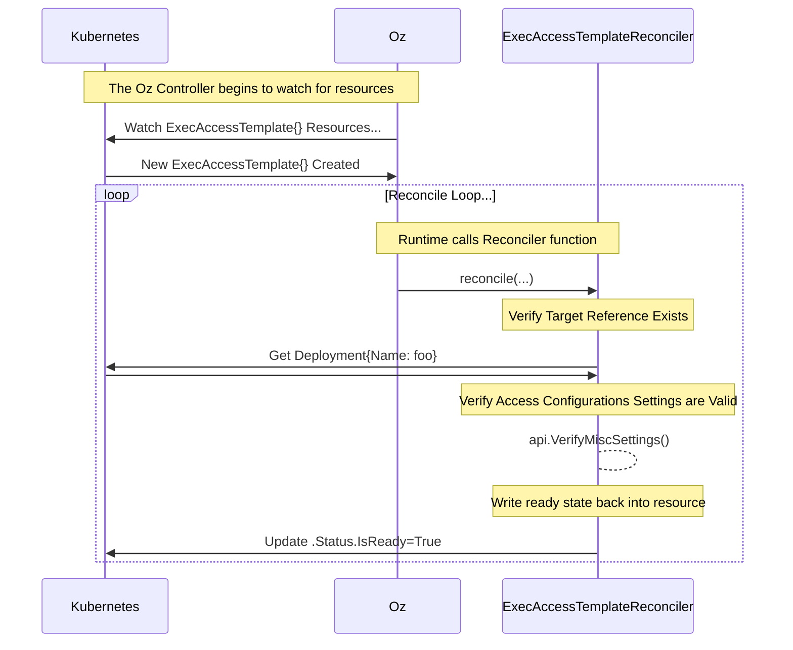
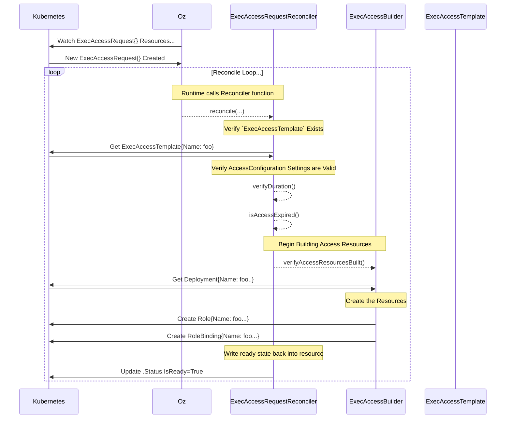
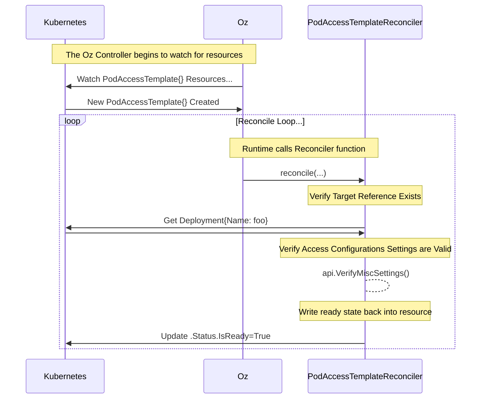
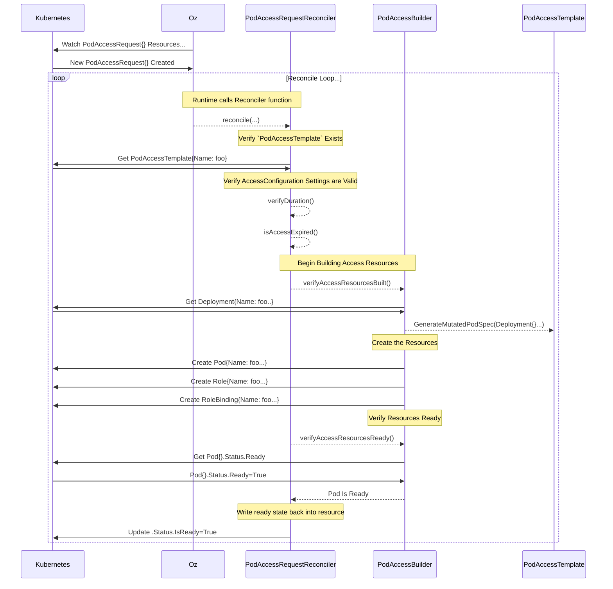

[exec_access_request]: /API.md#execaccessrequest
[exec_access_template]: /API.md#execaccesstemplate
[pod_access_request]: /API.md#podaccessrequest
[pod_access_template]: /API.md#podaccesstemplate
[access_config]: /API.md#accessconfig
[target_ref]: /API.md#crossversionobjectreference
[builders]: ./builders/README.md
[runtime]: https://github.com/kubernetes-sigs/controller-runtime

# Controllers

The Controllers in this package leverage the [controller-runtime][runtime]
package to define controllers that handle our custom resources
([PodAccessRequest][pod_access_request],
[PodAccessTemplate][pod_access_template],
[ExecAccessRequest][exec_access_request],
[ExecAccessTemplate][exec_access_request]). There are also controllers in this
package that handle inbound webhooks via the [Admission
Controllers](https://kubernetes.io/docs/reference/access-authn-authz/admission-controllers/)
system.

## Reconcilers

Our `Reconciler` controllers handle operating in a loop to ensure that our
Custom Resources are consistently in the desired state. These controllers all
implement a `reconcile()` function that is triggered by `Watch...` requests
against the Kubernetes API.

Generally speaking, we try to keep the `reconcile()` functions short and easy
to read/understand. The heavy lifting is actually done by our
[`Builder`][builders] structs.

## [`ExecAccessTemplateReconciler`](exec_access_template_controller.go)

The [`ExecAccessTemplateReconciler`](exec_access_template_controller.go) is a
very simple controller whose job is to make sure that the `ExecAccessTemplate`
is valid and available for use. It primarily validates that the template has
valid [`AccessConfig`][access_config] settings, and a valid
[`TargetRef`][target_ref] pointing to a real Pod controller (Deployment, etc).

## [`ExecAccessRequestReconciler`](exec_access_request_controller.go)

The [`ExecAccessRequestReconciler`](exec_access_request_controller.go) handles
creating a `Role` and `RoleBinding` that grant an engineer `kubectl exec ...`
access into an already existing Pod for a particular target deploymnt.

The reconciler logic itself is fairly simple, and most of the heavy lifting is
actually handled by a [`ExecAccessBuilder`](builders/exec_access_builder.go).

## [`PodAccessTemplateReconciler`](pod_access_template_controller.go)

The [`PodAccessTemplateReconciler`](pod_access_template_controller.go) is a
very simple controller whose job is to make sure that the `PodAccessTemplate`
is valid and available for use. It primarily validates that the template has
valid [`AccessConfig`][access_config] settings, and a valid
[`TargetRef`][target_ref] pointing to a real Pod controller (Deployment, etc).

## [`PodAccessRequestReconciler`](pod_access_request_controller.go)

The [`PodAccessRequestReconciler`](pod_access_request_controller.go) handles
the creation of a dedicated workload `Pod` for an engineer on-demand based on
the configuration of a [`PodAccessTemplate`](#podaccesstemplatereconciler). The
reconciler logic itself is fairly simple, and most of the heavy lifting is
actually handled by a [`PodAccessBuilder`](builders/pod_access_builder.go).

